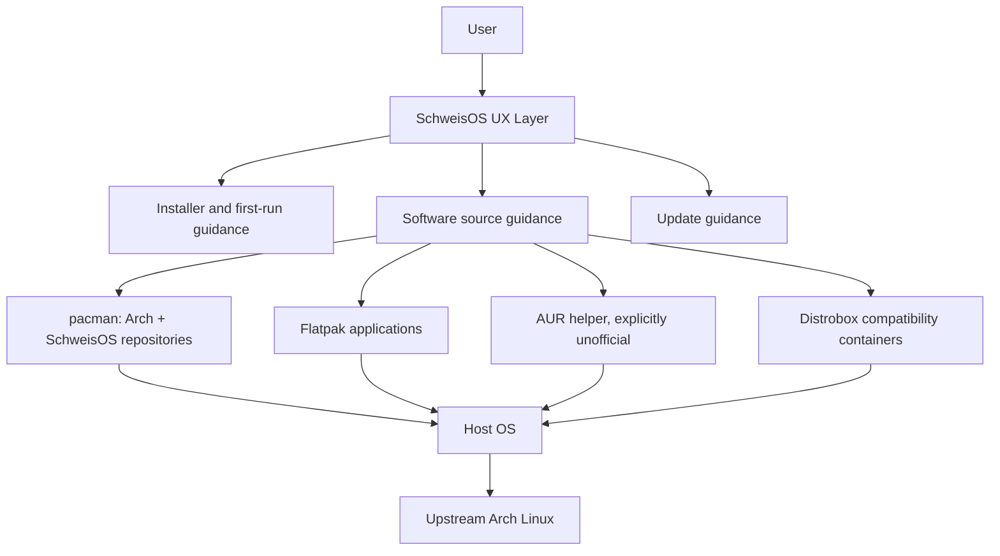

# SchweisOS Architecture Design Document

Version: 0.1
Status: Draft, bootstrap baseline
Date: 2026-07-24

## Scope

This document defines the first high-level architecture for SchweisOS. It covers system layers, component boundaries, repository organization, package strategy, ISO direction, installation model, update model, gaming model, Distrobox strategy, security assumptions, and the initial development sequence.

SchweisOS is not a new kernel, package manager, desktop environment, or Arch rewrite. It is a small, auditable Arch-based distribution layer that adds installation, defaults, documentation, source-aware software UX, and carefully selected integration around upstream Arch.

## Architectural Goal

The core question is: why should a user install SchweisOS instead of Arch Linux?

The answer must be technical:

- A guided installation path with sane desktop defaults.
- Clear source-aware software installation across official repositories, SchweisOS packages, Flatpak, AUR, and future Distrobox integrations.
- Gaming-oriented package selection and validation without unverified tweaks.
- Privacy and security defaults without telemetry or forced accounts.
- Living documentation that makes the distribution maintainable by one developer at first.

## System Layers



## Component Boundaries

| Layer | Responsibility | First implementation stance |
| --- | --- | --- |
| Upstream Arch | Kernel, base system, pacman, systemd, KDE packages, most applications | Use directly wherever possible |
| SchweisOS repository | Identity packages, keyring, mirror config, installer config, default settings, small meta packages | Keep small and signed |
| ISO layer | Live image, installer entry point, hardware-friendly package set | Build from archiso later |
| Installer layer | UEFI-first installation, systemd-boot default, ext4 default, optional Btrfs, GRUB alternative | Calamares later, no full disk encryption in first release |
| Desktop layer | KDE Plasma defaults, first-run guidance, Flatpak/AUR/Distrobox education | Avoid heavy custom shell patches |
| Software source layer | Explain and separate official repo, SchweisOS repo, Flatpak, AUR, Distrobox | Do not present all sources as equally trusted |
| Gaming layer | Steam, Proton-adjacent packages, GameMode/MangoHud/Gamescope where measurable | No folklore tweaks by default |
| Security layer | Package signing, ISO verification, no telemetry, explicit consent for reports | Secure Boot and disk encryption deferred |

## Repository Organization

SchweisOS starts as a monorepo:

```text
docs/
iso/
packages/
tools/
scripts/
branding/
website/
.github/
tests/
```

The monorepo is chosen because the early project has one maintainer. Splitting too early would increase coordination cost, version drift, and release mistakes. The layout still keeps boundaries clear enough to split later if the project grows.

Related decision: [ADR-001 Repository Strategy](../adr/ADR-001-repository-strategy.md).

## Package Architecture

SchweisOS packages must be boring on purpose. The first repository should contain only packages that define identity, trust, installability, and documented defaults.

Initial package categories:

- `schweisos-release`: distribution identity, release metadata, `/etc/os-release` integration.
- `schweisos-keyring`: package signing trust material.
- `schweisos-mirrorlist`: repository mirror configuration.
- `schweisos-pacman-config`: pacman repository include and conservative defaults.
- `schweisos-kde-settings`: KDE defaults through configuration files, not patched Plasma packages.
- `schweisos-calamares-config`: future installer configuration.
- `schweisos-gaming-meta`: optional gaming package set.
- `schweisos-flatpak-meta`: optional Flatpak integration package set.
- `schweisos-distrobox-meta`: optional Distrobox/Podman integration package set.

Package policy is defined in [Packaging Guide](../packaging/packaging-guide.md).

## ISO Architecture

SchweisOS should build install media using Arch's archiso tooling. Archiso is the established Arch mechanism for building live ISO images and supports custom package lists and profile files. The SchweisOS ISO layer must remain a profile and configuration set, not a fork of Arch's build system.

The ISO must eventually provide:

- UEFI boot path.
- KDE live session.
- Installer launcher.
- Network tools needed for installation.
- SchweisOS repository configuration.
- Documentation links and first-run warnings.

BIOS support is not required for the first release. Secure Boot is not a first-release goal.

Reference: [Archiso - ArchWiki](https://wiki.archlinux.org/title/Archiso).

## Boot Architecture

The installed system defaults to systemd-boot on UEFI systems. GRUB remains an alternative where needed. This matches the project goal of a simple default with a known fallback.

systemd-boot is UEFI-only, which matches the first-release UEFI priority. The installer must detect non-UEFI boot and either block unsupported installation paths or offer the documented GRUB path once it exists.

References: [systemd-boot - ArchWiki](https://wiki.archlinux.org/title/Systemd-boot), [systemd-boot manual](https://man.archlinux.org/man/core/systemd/systemd-boot.7.en).

## Filesystem Architecture

The default root filesystem is ext4. Btrfs is supported as an installer option but not the default.

This keeps the first release understandable and reliable while leaving room for future snapshot-based workflows. Btrfs support must not imply automatic rollback until rollback behavior is designed, tested, and documented.

Related decision: [ADR-004 Default Filesystem](../adr/ADR-004-default-filesystem.md).

## Update Architecture

SchweisOS follows Arch's full-system update model. Partial upgrades are not a supported user path.

The update UX may guide users, explain risk, and separate update domains, but it must not hide pacman or replace Arch package semantics. The domains are:

- Host packages through pacman.
- Flatpak applications through Flatpak.
- AUR packages through an explicitly unofficial AUR workflow.
- Distrobox containers through their own package managers.

Related decision: [ADR-007 Update Philosophy](../adr/ADR-007-update-philosophy.md).

## Software Source Architecture

SchweisOS must teach users where software comes from.

| Source | Trust model | UX rule |
| --- | --- | --- |
| Arch official repositories | Upstream Arch trust model | Preferred for system packages |
| SchweisOS repository | SchweisOS signed packages | Only small distribution layer |
| Flatpak | App/runtime sandbox and remote trust | Good for desktop apps, permissions visible |
| AUR | User-contributed build scripts, unofficial | Always warn before first use |
| Distrobox | Containerized foreign distribution userlands | Compatibility feature, not sandbox guarantee |

Flatpak provides application sandboxing with explicit permissions, while Distrobox intentionally integrates tightly with the host. They must not be described as equivalent security mechanisms.

References: [Flatpak sandbox permissions](https://docs.flatpak.org/en/latest/sandbox-permissions.html), [Distrobox README](https://github.com/89luca89/distrobox).

## Distrobox Architecture

Distrobox is a strategic compatibility layer, not a first-release core requirement.

The long-term SchweisOS idea is:

- User selects "install as Ubuntu/Debian/Fedora application".
- SchweisOS creates or reuses a rootless Distrobox container.
- The app is installed with the container distribution's package manager.
- Desktop entries are exported so the app appears in the normal launcher.
- The UI clearly labels the app as container-backed.

Important boundary: Distrobox is not a strong sandbox. It is designed to integrate containers with the host, including graphical apps and user files. Therefore SchweisOS must describe it as compatibility containment, not as a privacy or security boundary.

First supported stance:

- V1: document and optionally install `distrobox` + `podman`.
- V1.x: provide curated templates for Ubuntu LTS, Debian Stable, and Fedora current.
- V2: consider a GUI workflow after CLI behavior, security warnings, storage layout, and updates are tested.

No gaming stack should depend on Distrobox in the first release because GPU, Vulkan, controller, and anti-cheat behavior are too variable to make it a reliable default.

References: [Distrobox useful tips](https://github.com/89luca89/distrobox/blob/main/docs/useful_tips.md), [distrobox-export manual](https://manpages.opensuse.org/Tumbleweed/distrobox/distrobox-export.1).

Related decision: [ADR-006 Distrobox Strategy](../adr/ADR-006-distrobox-strategy.md).

## Gaming Architecture

Gaming is a core SchweisOS use case, but the project must avoid undocumented internet tweaks.

The first gaming layer should focus on:

- Correct graphics driver guidance.
- Steam and Proton ecosystem support.
- Optional GameMode, MangoHud, and Gamescope packages.
- Controller and audio sanity checks.
- Repeatable benchmark and smoke tests.

The distribution should prefer measurable improvements and reversible settings. Kernel replacement, scheduler tweaks, sysctl changes, and compositor changes must require evidence and ADRs.

Related decision: [ADR-005 Gaming Philosophy](../adr/ADR-005-gaming-philosophy.md).

## Security Model Summary

The first security boundary is packaging trust, not marketing language.

SchweisOS must:

- Sign its own packages.
- Ship a dedicated keyring package.
- Provide ISO checksums and signatures.
- Avoid telemetry by default.
- Require explicit user action for bug reports.
- Label AUR and Distrobox risks clearly.

Full disk encryption and Secure Boot are deferred to later releases, so the first release must be honest about that limitation.

Detailed policy: [Security Model](../security/security-model.md).

## Development Sequence

1. Documentation baseline.
2. Repository and package policy.
3. Keyring and release identity package design.
4. Minimal local package repository.
5. Minimal archiso profile.
6. KDE live ISO smoke boot.
7. Installer prototype with UEFI + systemd-boot + ext4.
8. Optional Btrfs installer path.
9. Flatpak integration.
10. AUR first-use warning workflow.
11. Gaming meta package and test matrix.
12. Distrobox CLI support and documentation.
13. Release signing and mirror process.
14. Alpha ISO.

The sequence intentionally starts with documentation and trust infrastructure before user-facing customization.

## Open Questions

- Which AUR helper, if any, should be recommended?
- Should the first ISO include NVIDIA proprietary driver support or install it post-install only?
- What exact Calamares version and module set will be used?
- Should Btrfs use a subvolume layout in the first installer path, even without snapshots?
- What minimum hardware target should define the KDE experience?

These questions require later ADRs before implementation.
