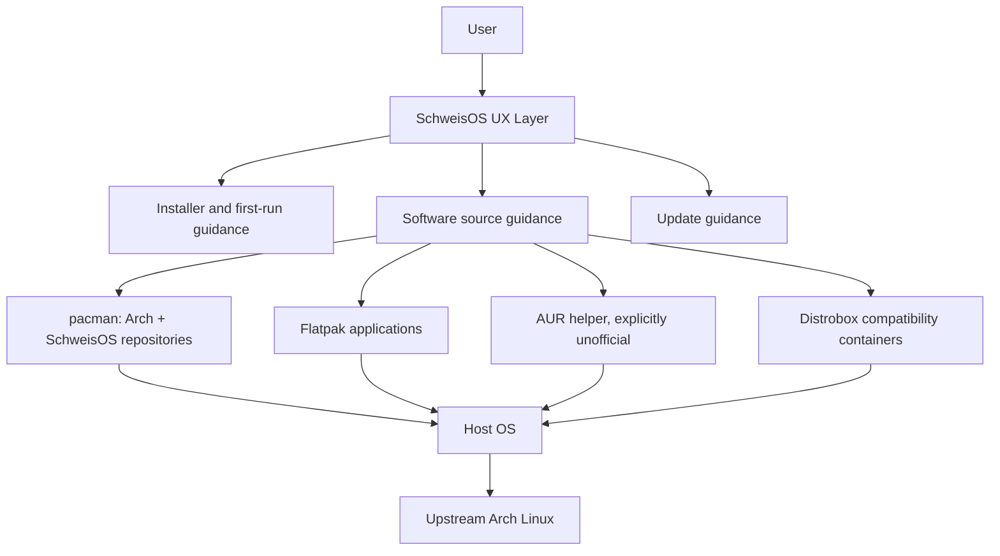

# SchweisOS Architecture Design Document

Version: 0.5
Status: Active pre-alpha architecture
Date: 2026-07-28

## Scope

This document defines the first high-level architecture for SchweisOS. It covers system layers, component boundaries, repository organization, package strategy, ISO direction, installation model, update model, gaming model, Distrobox strategy, security assumptions, and the initial development sequence.

SchweisOS is not a new kernel, package manager, desktop environment, or Arch rewrite. It is a small, auditable Arch-based distribution layer that adds installation, defaults, documentation, source-aware software UX, and carefully selected integration around upstream Arch.

## Architectural Goal

The core question is: why should a user install SchweisOS instead of Arch Linux?

The answer must be technical:

- A guided installation path with sane desktop defaults.
- Clear source-aware software installation across official repositories, SchweisOS packages, Flatpak, AUR, and future Distrobox integrations.
- Gaming-oriented package selection and validation without unverified tweaks.
- Privacy and security defaults without telemetry or forced accounts.
- Living documentation that makes the distribution maintainable by one developer at first.

## Implementation Snapshot

Architecture and implementation are deliberately separated. As of
2026-07-27, the repository contains a KDE Archiso profile, five SchweisOS
packages, production public trust material, role-separated signing tools, a
signed local production repository workflow, disposable client validation, and
a development ISO build pipeline.

The following remain unimplemented or incomplete: an installer, installed
system boot configuration, public mirrors and publication, ISO detached
signing, Secure Boot, disk encryption, Flatpak/AUR user workflows, gaming
integration, Distrobox automation, and release-grade hardware/boot
qualification. This snapshot records implementation state; ADRs remain the
authority for accepted design.

## System Layers



## Component Boundaries

| Layer | Responsibility | First implementation stance |
| --- | --- | --- |
| Upstream Arch | Kernel, base system, pacman, systemd, KDE packages, most applications | Use directly wherever possible |
| SchweisOS repository | Identity packages, keyring, mirror config, installer config, default settings, small meta packages | Keep small and signed |
| ISO layer | Live image, future installer entry point, hardware-friendly package set | KDE Archiso profile implemented with upstream archiso |
| Installer layer | UEFI-first installation, systemd-boot default, ext4 default, optional Btrfs, GRUB alternative | Calamares later, no full disk encryption in first release |
| Desktop layer | KDE Plasma defaults, first-run guidance, Flatpak/AUR/Distrobox education | Avoid heavy custom shell patches |
| Software source layer | Explain and separate official repo, SchweisOS repo, Flatpak, AUR, Distrobox | Do not present all sources as equally trusted |
| Gaming layer | Steam, Proton-adjacent packages, GameMode/MangoHud/Gamescope where measurable | No folklore tweaks by default |
| Security layer | Package signing, ISO verification, no telemetry, explicit consent for reports | Secure Boot and disk encryption deferred |

## Repository Organization

SchweisOS starts as a monorepo:

```text
docs/
iso/
packages/
tools/
scripts/
branding/
website/
.github/
tests/
```

The monorepo is chosen because the early project has one maintainer. Splitting too early would increase coordination cost, version drift, and release mistakes. The layout still keeps boundaries clear enough to split later if the project grows.

Related decision: [ADR-001 Repository Strategy](../adr/ADR-001-repository-strategy.md).

## Distribution Identity Layer

The Distribution Identity Layer is the smallest host-level layer that makes an installed system recognizably and safely SchweisOS.

It is made of four infrastructure packages:

- `schweisos-release`
- `schweisos-keyring`
- `schweisos-mirrorlist`
- `schweisos-pacman-config`

These packages sit between upstream Arch and higher-level SchweisOS features. They do not provide a desktop experience, gaming stack, installer behavior, Flatpak integration, AUR workflow, or Distrobox workflow. Their job is to define identity, trust, repository discovery, and pacman integration.

| Package | Architectural responsibility | Must not own |
| --- | --- | --- |
| `schweisos-release` | Distribution identity, release metadata, project URLs, `/etc/os-release` integration | Repository enablement, signing keys, desktop defaults |
| `schweisos-keyring` | Public signing keys for official SchweisOS packages | Third-party trust, disabled signature checks, mirror policy |
| `schweisos-mirrorlist` | Official SchweisOS mirror endpoints | Arch mirror configuration, automatic mirror ranking |
| `schweisos-pacman-config` | pacman snippets for official SchweisOS repositories | Update manager behavior, partial-upgrade policy, AUR configuration |

This split keeps the first distribution package set auditable. Identity can be inspected without reading repository configuration; trust material can be updated without changing release metadata; mirror changes can be shipped without changing pacman policy.

`schweisos-release` owns the canonical metadata at
`/usr/lib/schweisos-release/os-release` and a relative `/etc/os-release` link to
it. Standard consumers therefore see SchweisOS while Arch's `filesystem`
package continues to own `/usr/lib/os-release` as an upstream fallback. The
package uses no install-time rewrite. Installed systems keep the package-owned
identity byte-for-byte. Live media keeps the same fields and, during image
construction, upstream Archiso appends exactly `IMAGE_ID` and `IMAGE_VERSION`
from the validated profile.

The layer must preserve Arch package semantics. It integrates SchweisOS repositories into pacman; it does not replace pacman, hide package sources, or redefine the update model.

Related decision: [ADR-009 Distribution Identity Packages](../adr/ADR-009-distribution-identity-packages.md).

## Branding Layer

SchweisOS visual identity is separate from distribution identity.

Source artwork and brand guidance live under `branding/`. Runtime-ready brand
assets are delivered by `schweisos-branding`, a small package that provides the
icon name referenced by `LOGO=schweisos` and generic desktop icon lookup paths.

`schweisos-branding` must not configure wallpapers, themes, SDDM appearance,
Plymouth, installer pages, bootloader visuals, or KDE defaults. Those areas
remain separate feature packages or profile decisions when they are approved.
This keeps identity metadata, brand assets, and desktop customization from
becoming one unreviewable package.

The KDE live ISO boot splash is one approved profile decision. Its Plymouth
theme consumes the packaged runtime logo from `/usr/share/schweisos/branding`;
it does not move boot behavior into `schweisos-branding` and does not copy logo
assets into the ISO profile.

## Package Architecture

SchweisOS packages must be boring on purpose. The first repository should contain only packages that define identity, trust, installability, and documented defaults.

Initial package categories:

- `schweisos-release`: distribution identity, release metadata, `/etc/os-release` integration.
- `schweisos-keyring`: package signing trust material.
- `schweisos-mirrorlist`: repository mirror configuration.
- `schweisos-pacman-config`: pacman repository include and conservative defaults.
- `schweisos-branding`: minimal runtime visual identity assets.
- `schweisos-kde-settings`: KDE defaults through configuration files, not patched Plasma packages.
- `schweisos-calamares-config`: future installer configuration.
- `schweisos-gaming-meta`: optional gaming package set.
- `schweisos-flatpak-meta`: optional Flatpak integration package set.
- `schweisos-distrobox-meta`: optional Distrobox/Podman integration package set.

Package policy is defined in [Packaging Guide](../packaging/packaging-guide.md).

## Package Repository Architecture

SchweisOS maintains its own small signed package repository for SchweisOS-owned packages only. Arch `core`, `extra`, and `multilib` remain upstream Arch repositories and must not be redefined as SchweisOS repositories.

The planned SchweisOS repository family is:

- `schweisos`: stable SchweisOS packages, enabled by default for stable installations.
- `schweisos-testing`: release candidate packages for testers and pre-release ISO work, disabled by default.
- `schweisos-staging`: maintainer integration repository, internal by default.

The package lifecycle is:

```text
Developer
  -> PKGBUILD
  -> makepkg
  -> package validation
  -> package signing
  -> repository database
  -> repository database signing
  -> artifact publication
  -> mirror synchronization
  -> user installation through pacman
```

Trust begins with a verified ISO and `schweisos-keyring`. `schweisos-pacman-config` must enable only official SchweisOS repositories using trusted package signatures. Mirrors distribute artifacts; they are not trust anchors.

The long-lived master trust key remains offline. Routine package and repository
database signing uses separately authorized operational keys on a restricted
signing host; developer machines and build workers do not own production
signing authority.

The production hierarchy uses one certification-only Ed25519 primary with a
ten-year lifetime and separate one-year Ed25519 signing subkeys for packages
and repository databases. Private primary material remains on independently
stored encrypted offline media. Clients receive only the reviewed public
certificate, trust metadata, and revocation metadata through
`schweisos-keyring`. Signing tooling binds every operation to the exact
role-specific subkey fingerprint and verifies its output before publication.

Local development repository tooling may create an unsigned file-based
repository under `out/local-repo/` for package bootstrap testing. This
repository is a developer convenience only. It must not be treated as release
infrastructure, artifact storage, mirror source, or part of the official
SchweisOS trust model.

The bootstrap mirrorlist may also provide a local file-based development
endpoint under `/var/lib/schweisos/local-repo/$repo/os/$arch` so pacman can
parse repository integration on a build host. This endpoint is not a production
mirror, canonical endpoint, or trust anchor. It remains fail-closed under
trusted package and repository database signature policy until signed artifacts
and approved public keys exist.

Repository architecture is defined in
[ADR-011 Repository Architecture](../adr/ADR-011-repository-architecture.md).
The canonical lifecycle and signing boundaries are documented in
[Package Repository Workflow](../release/repository-workflow.md) and
[Release Signing Workflow](../release/release-signing-workflow.md).

## ISO Architecture

SchweisOS builds live and installation media with the upstream `archiso` package. The project owns a small archiso profile; it does not fork archiso or maintain a custom image-building framework.

The ISO is a downstream consumer of validated Arch and SchweisOS package repositories. ISO assembly must not implicitly build SchweisOS packages or become an alternative package publication path.

The current profile lives under `iso/profiles/kde/` and separates these concerns:

| Concern | Architectural owner |
| --- | --- |
| Image metadata, boot modes, package composition | `profiledef.sh` and `packages.x86_64` |
| Build-time package resolution | Profile-local `pacman.conf` |
| Exceptional live-only filesystem content | Minimal `airootfs/` overlay |
| Live-medium UEFI boot configuration | `efiboot/` following supported archiso interfaces |
| Reusable system behavior and persistent configuration | SchweisOS packages under `packages/` |
| Source artwork and brand policy | `branding/` and `schweisos-branding` |
| Canonical documentation | `docs/`, packaged when offline media access is required |

Persistent, reusable, security-relevant, or updateable configuration belongs in packages rather than `airootfs/`. This provides pacman ownership, signatures, versioned upgrades, removal behavior, and independent validation. The overlay remains an exception for archiso-native or genuinely ephemeral live-session files.

Expected future ISO-facing packages include KDE defaults, installer configuration and launcher integration, offline documentation, and any substantial live-session helper that cannot be supplied upstream. Minimal properly licensed branding is now delivered by `schweisos-branding`; broader visual customization still requires separate package design. Exact contents require their own package design; the profile should only list the resulting package names.

The current live image provides UEFI boot, a SchweisOS systemd-boot menu,
Plymouth splash with automatic diagnostic fallback, KDE Plasma, networking, and
a compact troubleshooting/user utility set. The ISO must still gain:

- A clear installer launcher.
- Offline access to essential installation and troubleshooting documentation.
- Release-grade boot and hardware validation.

The live-media boot path is separate from installed-system boot policy. systemd-boot remains the installed-system default on UEFI systems, while archiso owns how the medium boots. A `syslinux/` profile area is relevant only if legacy BIOS support is approved later. BIOS support and Secure Boot are not first-release requirements.

Related decisions: [ADR-012 ISO Build Architecture](../adr/ADR-012-iso-build-architecture.md),
[ADR-014 Live Boot Experience Architecture](../adr/ADR-014-live-boot-experience-architecture.md),
and [DDR-001 Boot Experience](../ddr/DDR-001-boot-experience.md).

## ISO Build Workflow

SchweisOS ISO builds use upstream `mkarchiso` on an Arch Linux build host. The build workflow is separate from the ISO profile: the profile declares image composition, while build tooling prepares directories, validates inputs, records logs, and invokes archiso with explicit paths.

Generated ISO state must stay outside the profile source:

- `work/` for temporary archiso state.
- `out/` for generated ISO artifacts.
- `cache/` for local package cache state.
- `logs/` for build and validation records.

The build workflow consumes already-built Arch and SchweisOS packages. It must not build packages, sign artifacts, publish repositories, synchronize mirrors, modify global pacman configuration, or hide release actions inside ISO assembly.

Related decision: [ADR-013 ISO Build Workflow](../adr/ADR-013-iso-build-workflow.md).

## Boot Architecture

The installed system defaults to systemd-boot on UEFI systems. GRUB remains an alternative where needed. This matches the project goal of a simple default with a known fallback.

systemd-boot is UEFI-only, which matches the first-release UEFI priority. The installer must detect non-UEFI boot and either block unsupported installation paths or offer the documented GRUB path once it exists.

The live medium uses Archiso's upstream `uefi.systemd-boot` path. Its normal
entry is quiet and splash-enabled, while a separate debug entry keeps verbose
kernel and systemd status visible. The live initramfs uses upstream mkinitcpio
`kms` and `plymouth` hooks so the SchweisOS Plymouth theme can appear before the
Plasma session. If emergency mode is reached, SDDM fails, Plymouth start/quit
units fail, or the Plymouth runtime PID disappears before the normal quit
handoff, the live profile quits Plymouth and restores console diagnostics.

This live boot experience does not implement installed-system bootloader
configuration. Installed-system Plymouth, bootloader installation, Secure Boot,
and BIOS behavior remain future installer architecture.

References: [systemd-boot - ArchWiki](https://wiki.archlinux.org/title/Systemd-boot), [systemd-boot manual](https://man.archlinux.org/man/core/systemd/systemd-boot.7.en).

## Filesystem Architecture

The default root filesystem is ext4. Btrfs is supported as an installer option but not the default.

This keeps the first release understandable and reliable while leaving room for future snapshot-based workflows. Btrfs support must not imply automatic rollback until rollback behavior is designed, tested, and documented.

Related decision: [ADR-004 Default Filesystem](../adr/ADR-004-default-filesystem.md).

## Update Architecture

SchweisOS follows Arch's full-system update model. Partial upgrades are not a supported user path.

The update UX may guide users, explain risk, and separate update domains, but it must not hide pacman or replace Arch package semantics. The domains are:

- Host packages through pacman.
- Flatpak applications through Flatpak.
- AUR packages through an explicitly unofficial AUR workflow.
- Distrobox containers through their own package managers.

Related decision: [ADR-007 Update Philosophy](../adr/ADR-007-update-philosophy.md).

## Software Source Architecture

SchweisOS must teach users where software comes from.

| Source | Trust model | UX rule |
| --- | --- | --- |
| Arch official repositories | Upstream Arch trust model | Preferred for system packages |
| SchweisOS repository | SchweisOS signed packages | Only small distribution layer |
| Flatpak | App/runtime sandbox and remote trust | Good for desktop apps, permissions visible |
| AUR | User-contributed build scripts, unofficial | Always warn before first use |
| Distrobox | Containerized foreign distribution userlands | Compatibility feature, not sandbox guarantee |

Flatpak provides application sandboxing with explicit permissions, while Distrobox intentionally integrates tightly with the host. They must not be described as equivalent security mechanisms.

References: [Flatpak sandbox permissions](https://docs.flatpak.org/en/latest/sandbox-permissions.html), [Distrobox README](https://github.com/89luca89/distrobox).

## Distrobox Architecture

Distrobox is a strategic compatibility layer. `distrobox` and rootless
`podman` are present in the current live package set, but SchweisOS does not
yet provide automation, curated containers, or a GUI workflow.

The long-term SchweisOS idea is:

- User selects "install as Ubuntu/Debian/Fedora application".
- SchweisOS creates or reuses a rootless Distrobox container.
- The app is installed with the container distribution's package manager.
- Desktop entries are exported so the app appears in the normal launcher.
- The UI clearly labels the app as container-backed.

Important boundary: Distrobox is not a strong sandbox. It is designed to integrate containers with the host, including graphical apps and user files. Therefore SchweisOS must describe it as compatibility containment, not as a privacy or security boundary.

Supported progression:

- V1: install and document `distrobox` + `podman` without custom automation.
- V1.x: provide curated templates for Ubuntu LTS, Debian Stable, and Fedora current.
- V2: consider a GUI workflow after CLI behavior, security warnings, storage layout, and updates are tested.

No gaming stack should depend on Distrobox in the first release because GPU, Vulkan, controller, and anti-cheat behavior are too variable to make it a reliable default.

References: [Distrobox useful tips](https://github.com/89luca89/distrobox/blob/main/docs/useful_tips.md), [distrobox-export manual](https://manpages.opensuse.org/Tumbleweed/distrobox/distrobox-export.1).

Related decision: [ADR-006 Distrobox Strategy](../adr/ADR-006-distrobox-strategy.md).

## Gaming Architecture

Gaming is a core SchweisOS use case, but the project must avoid undocumented internet tweaks.

The first gaming layer should focus on:

- Correct graphics driver guidance.
- Steam and Proton ecosystem support.
- Optional GameMode, MangoHud, and Gamescope packages.
- Controller and audio sanity checks.
- Repeatable benchmark and smoke tests.

The distribution should prefer measurable improvements and reversible settings. Kernel replacement, scheduler tweaks, sysctl changes, and compositor changes must require evidence and ADRs.

Related decision: [ADR-005 Gaming Philosophy](../adr/ADR-005-gaming-philosophy.md).

## Security Model Summary

The first security boundary is packaging trust, not marketing language.

SchweisOS must:

- Continue signing its own packages and repository databases with separate
  authorized operational roles.
- Maintain the dedicated `schweisos-keyring` trust package and documented
  rotation/revocation process.
- Provide ISO checksums and signatures.
- Avoid telemetry by default.
- Require explicit user action for bug reports.
- Label AUR and Distrobox risks clearly.

Full disk encryption and Secure Boot are deferred to later releases, so the first release must be honest about that limitation.

Detailed policy: [Security Model](../security/security-model.md).

## Development Sequence

The documentation, identity package set, trust bootstrap, signed local
repository, minimal KDE profile, and first development ISO are complete as
engineering foundations. The next dependency-ordered sequence is:

1. Add ISO signing and verification without placing private keys on the build
   host.
2. Design and implement the installer prototype for UEFI, systemd-boot, and
   ext4.
3. Validate a complete installation and first boot on disposable test storage.
4. Add the optional Btrfs path after the ext4 path is reliable.
5. Establish a public publication endpoint and mirror operations.
6. Implement Flatpak integration and the AUR first-use warning workflow.
7. Add a measured gaming package/test matrix.
8. Document the installed Distrobox/Podman baseline before any automation.
9. Complete alpha release qualification and known-issues documentation.

Trust infrastructure remains ahead of user-facing customization so later
features can consume an auditable release path.

## Open Questions

- Which AUR helper, if any, should be recommended?
- Should the first ISO include NVIDIA proprietary driver support or install it post-install only?
- What exact Calamares version and module set will be used?
- Should Btrfs use a subvolume layout in the first installer path, even without snapshots?
- What minimum hardware target should define the KDE experience?

These questions require later ADRs before implementation.
